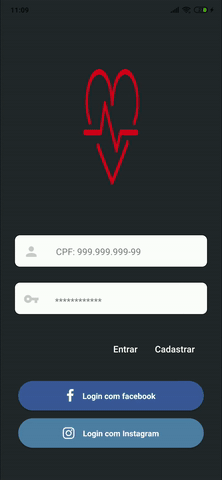
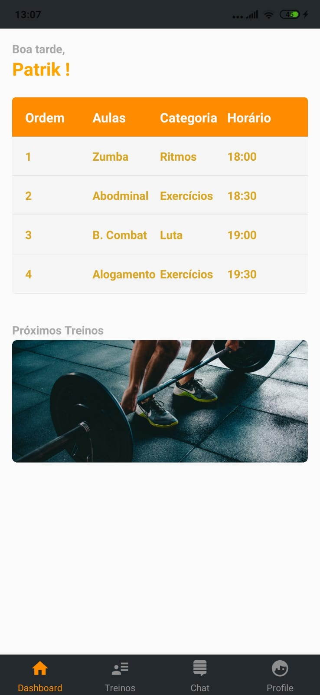
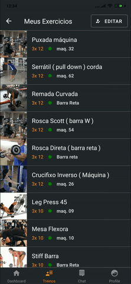
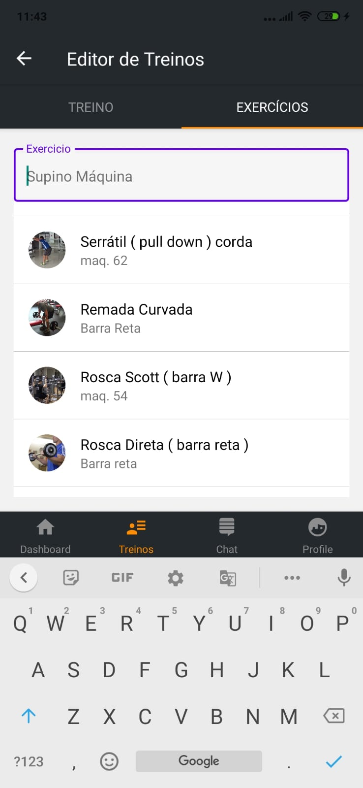
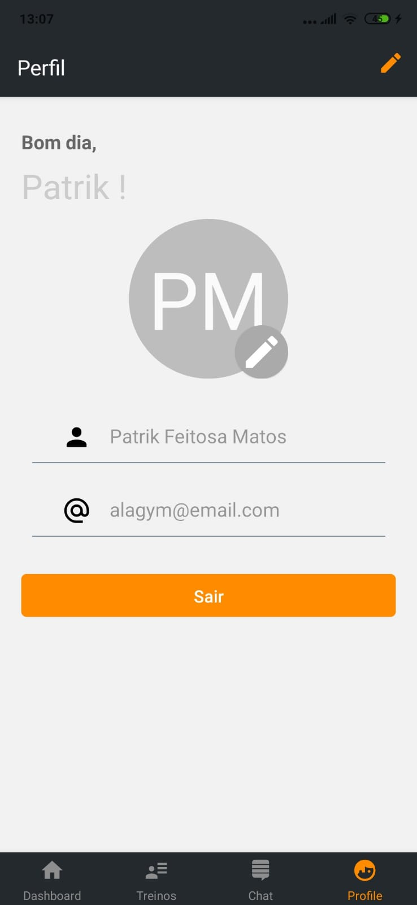

# ALAGYM MOBILE

## Autenticação / Cadastro

Telas para login e cadastro de usuários.

## Dashboard

Uma tela que mostra o resumo das outras funcionalidades.

## Gerenciador de Treinos

Telas que mostram os treinos do aluno e também permitem que professores e personal trainers editem os treinos de seus alunos. Além disso, os personal trainers podem visualizar e editar os treinos do aluno que quiser.

|  |  |  |
| ---------------------------------------------------- | ----------------------------------------------------- | ----------------------------------------------------------- |

## Perfil

Uma tela para visualizar e editar as informações pessoais com suporte à foto de perfil.

